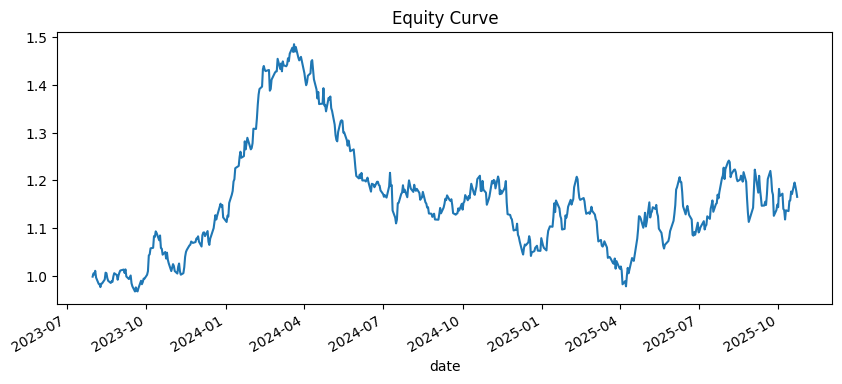
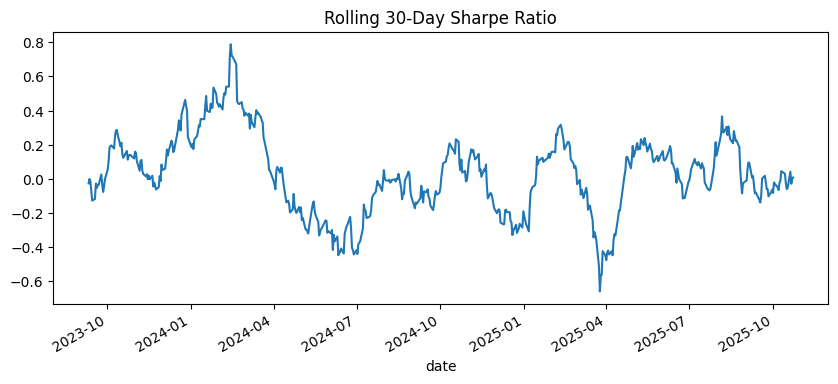
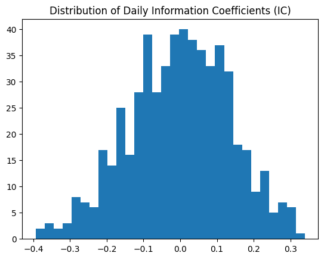
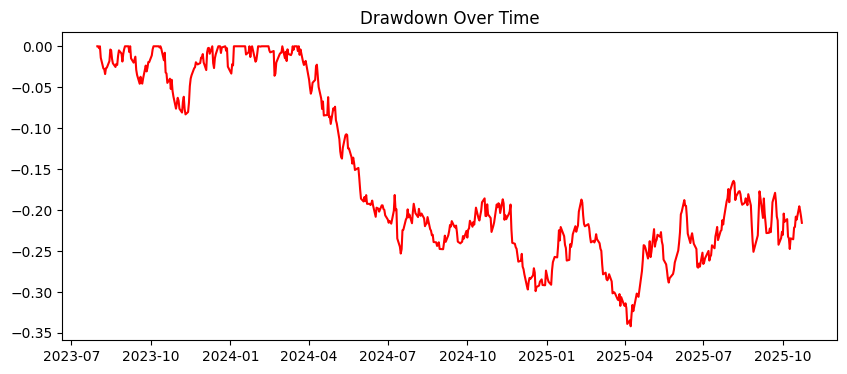
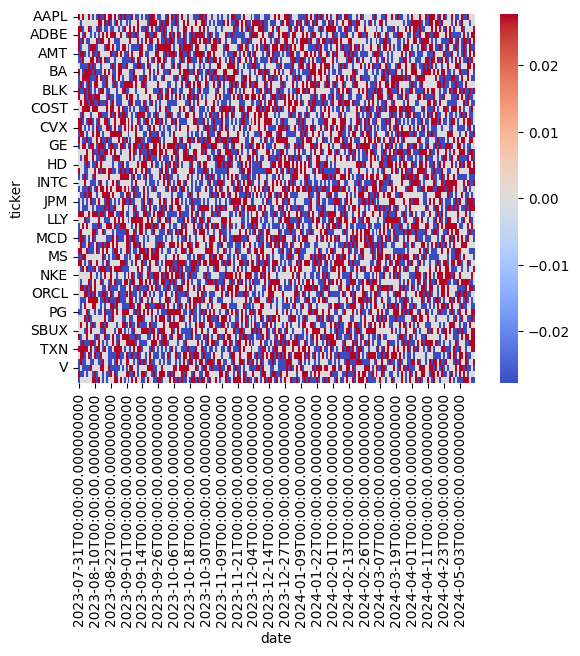

# Dynamic Multi-Factor Equity Strategy Simulator

A machine-learning–driven long–short equity model with automated data pipeline, factor engineering, cross-sectional return prediction, and full backtest.

## Overview

This project implements a dynamic multi-factor equity model that predicts 21-day forward returns for a universe of large-cap U.S. equities using cross-sectional machine learning. Predictions are converted into daily long-short portfolio weights and evaluated using a robust backtesting framework.

* The project includes:
* Automatic daily data ingestion (Yahoo Finance)
* Factor engineering (momentum, volatility, etc.)
* Cross-sectional Ridge Regression model
* Information Coefficient (IC) analysis
* Long–short portfolio construction
* Rolling backtest with performance statistics
* Full visualizations (equity curve, rolling Sharpe, drawdowns, IC distribution)

This project aligns closely with workflows used at quantitative investment firms such as Jane Street, AQR, and Los Angeles Capital.

## Repository Structure
├── data_pipeline/  
│  ├── update_data.py             # Fetches raw data, builds features 
│   └── data/ 
│       ├── raw/                   # Raw Yahoo Finance prices 
│       └── processed/             # Cleaned returns, forward returns, features, panel  
│ 
├── notebooks/ 
│   ├── modeling.ipynb             # Full modeling + backtesting workflow 
│   ├── sanitycheck1.ipynb         # Sanity Check on update_data.py 
│   └── ridge_model.ipynb           # Saved trained model  
│  
├── README.md 

## 1. Data Pipeline

All data is updated automatically through:

`python data_pipeline/update_data.py`

The pipeline:
* Downloads OHLCV data for a selected universe of large-cap tickers
* Computes:
    * Daily returns
    * 21-day forward cumulative returns
    * Factor features:
        * 30-day momentum   
        * 90-day momentum
        * 30-day realized volatility
* Aligns all tickers into a unified panel
* Saves results into /processed files:
    * daily_returns.csv
    * fwd_returns_21d.csv
    * features_basic.csv
    * model_panel.csv

## 2. Factor Engineering

This project uses classic quantitative equity factors:

### Momentum (30D, 90D) - Measures recent performance:

`mom30 = price.pct_change(30)` 
`mom90 = price.pct_change(90)`

### Volatility (30D) - Measures short-term variation:

`vol30 = daily_returns.rolling(30).std()`

These factors are widely used in academic literature and industry‐grade quant models.

## 3. Modeling Approach

Cross-sectional Ridge Regression
We train the model to predict forward 21-day returns across a universe of stocks on each date.

Key components:
* StandardScaler → scales all features
* Ridge Regression → handles multicollinearity + stabilizes coefficients
* Time-aware split → train on early period, test on later period
* Primary metric: Information Coefficient (IC)
    * Measures predictive rank-order skill:
        * “Did stocks the model predicted to outperform actually outperform?”

This avoids look-ahead bias and mimics real quant workflows.

## 4. Backtesting Methodology
Signals → Weights

Model predictions are transformed into daily portfolio weights using Z-score normalization:

`weights = zscore(predictions_by_day)`
`weights = weights / sum(abs(weights))`

Long–Short Portfolio
* Long stocks with positive signals
* Short stocks with negative signals
* Market-neutral (sum(weights) = 0)

Portfolio Return Calculation
Each day's portfolio earns the 21-day forward return of the stocks held on that day:

`portfolio_ret[t] = Σ_i (weight[t, i] * fwd_ret[t, i])`

Performance Metrics
* Annualized return
* Annualized volatility
* Sharpe ratio
* Max drawdown
* Average turnover per rebalance
* Distribution of daily ICs

## 5. Backtest Results

### Summary Statistics  
Annualized Return -> .0033  
Annualized Volatility -> .045  
Sharpe Ratio -> .073  
Max Drawdown -> -0.34  
Average Turnover -> 1.39  
Mean Daily IC -> -0.0010  
Std Dev Daily IC -> 0.137  
Number of IC Observations -> 562

## 6. Visualizations

Paste plots directly into the README or link to images in the repo.

6.1 Equity Curve

6.2 Rolling 30-Day Sharpe

6.3 Distribution of Daily IC

6.4 Drawdowns Over Time

6.5 Weight Heatmap (Optional but Impressive)

## 7. Interpretation & Lessons Learned

* The baseline model demonstrates low predictive power (IC ≈ 0).
* High turnover indicates that the model reacts strongly to noise.
* Sharpe ratio and max drawdown highlight the need for:
    * Better feature engineering
    * Return horizon adjustments
    * Regularization tuning
    * Nonlinear models (Random Forest, XGBoost)
    * Portfolio constraints (turnover limits, volatility targeting)
* Despite low initial performance, this workflow establishes a complete, production-style quant research pipeline, forming a strong foundation for further refinement.

## 8. Future Improvements

* Add more factors (beta, size, value, quality, volatility-of-vol)
* Use gradient boosting or neural networks
* Sector/industry neutralization
* Transaction cost model
* Volatility-targeted position sizing
* Non-overlapping forward return windows
* Expand universe to mid-caps

## 9. How to Run This Project
### Clone the repo

`git clone <YOUR_REPO_URL>`  
`cd dynamic-factor-model`

### Install dependencies 
`pip install -r requirements.txt`

### Update data  
`python data_pipeline/update_data.py`

### Run notebook

Open:  
`notebooks/modeling.ipynb`

Run all cells to reproduce the complete modeling + backtesting workflow.

## Author

Emmet Andrews  
emmet.andrews.2026@anderson.ucla.edu  
UCLA Anderson MSBA 
Quantitative Modeling / Data Science for Finance 
LinkedIn: https://www.linkedin.com/in/emmet-andrews/